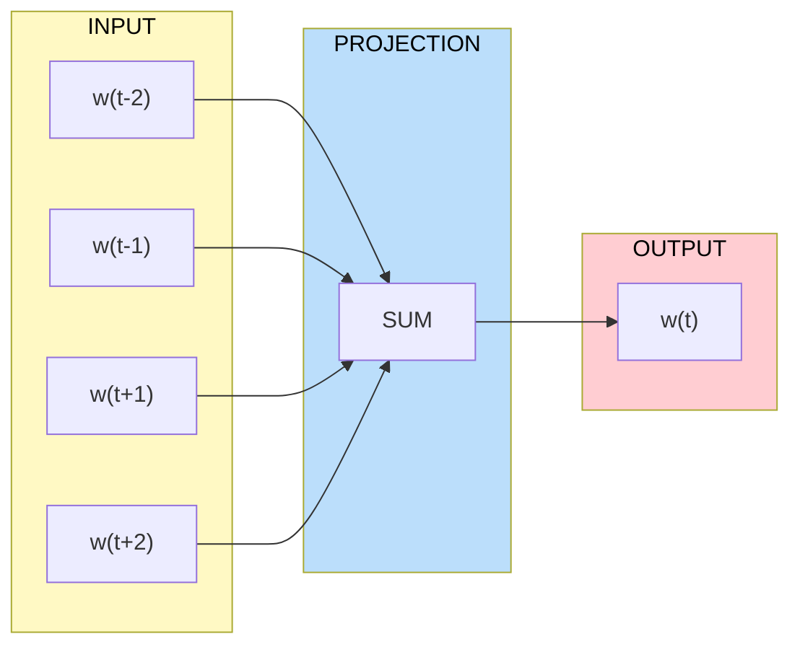
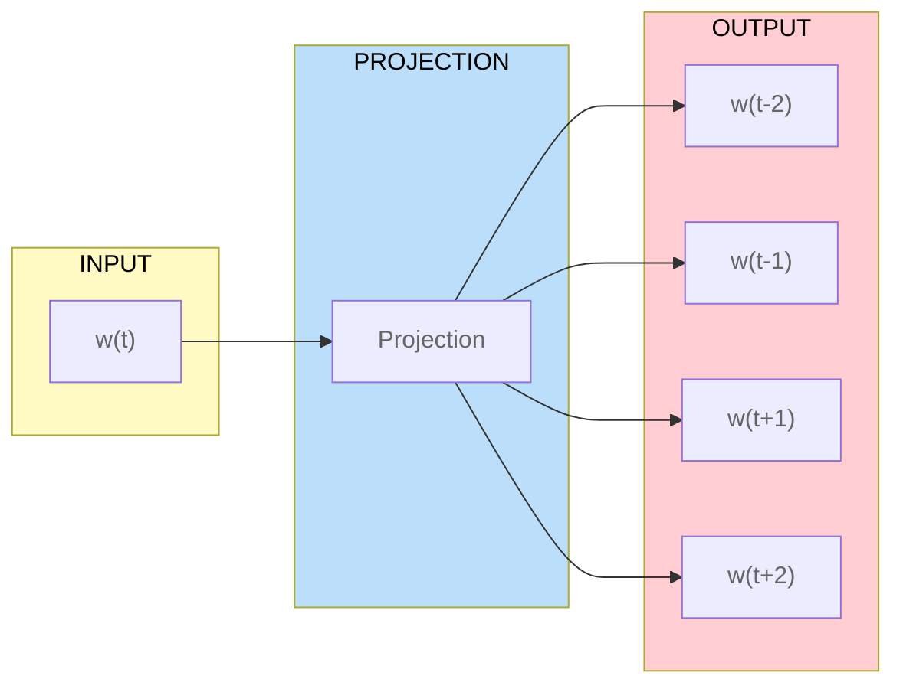

# Awesome [Word2vec](https://en.wikipedia.org/wiki/Word2vec) 

    
    &nbsp;
    
    &nbsp;
    
    

---
---

## 📖 Contents
- [CBOW](#continuous-bag-of-words-cbow)
- [Skip-gram](#skip-gram)
- [My Other Awesome Lists](#my-other-awesome-lists)
- [Contributing](#contributing)
- [Contributors](#contributors)

## Continuous [bag-of-words](https://en.wikipedia.org/wiki/Bag-of-words_model) (CBOW)

---
---

## Skip-gram

##

### My Other Awesome Lists
You can access the my other awesome lists [here](https://cyberthreatdefence.com/my_awesome_lists)

### Contributing
[Contributions of any kind welcome, just follow the guidelines](contributing.md)!

### Contributors
[Thanks goes to these contributors](https://github.com/cybersecurity-dev/awesome-word2vec/graphs/contributors)!

[🔼 Back to top](#awesome-word2vec-)
